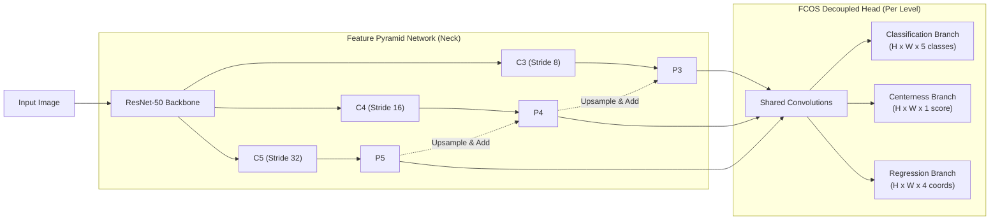

# YOLOv8-inspired Anchor-Free Detector (FCOS)

Mô hình Object Detection được xây dựng hoàn toàn từ đầu (from scratch) dựa trên triết lý **Anchor-Free** của các kiến trúc YOLO hiện đại (như YOLOX, YOLOv8) và FCOS. 

Khác với các thế hệ YOLO cũ dùng hộp neo (anchor-based), mô hình này dự đoán trực tiếp tọa độ hộp bao từ các điểm lưới (grid points) trên Feature Pyramid Network (FPN), kết hợp với Backbone ResNet-50 và nhánh Centerness Penalty để tối ưu hóa mAP. Mô hình dự đoán 5 lớp đối tượng: `person`, `car`, `dog`, `cat`, `chair`.

## Tính năng kỹ thuật nổi bật
Toàn bộ mã nguồn được lập trình bằng PyTorch thuần túy ( không sử dụng các thư viện detection xây sẵn như Detectron2 hay model YOLO có sẵn của Ultralytics).
- **Mạng trích xuất đặc trưng (Backbone):** ResNet-50 kiến trúc nguyên bản (tự xây dựng các Bottleneck).
- **Cổ chai đặc trưng (Neck):** Feature Pyramid Network (PANet) đa tỷ lệ nối các Feature map P3, P4, P5.
- **Đầu dự đoán (Decoupled Head):** Tách biệt nhánh dự đoán phân lớp (Classification), hộp bao (Regression) và độ lệch tâm (Centerness) giúp giảm nhiễu.
- **Hàm mất mát (Loss):** Sử dụng Focal Loss (chống mất cân bằng dữ liệu foreground/background), GIoU Loss (tối ưu overlap hộp bao), và BCE Loss (cho Centerness).
- **Hậu xử lý (Post-processing):** Tích hợp Test-Time Augmentation (TTA) lật ngang ảnh và Centerness Penalty ($scores = cls \times ctr^2$) để triệt tiêu nhiễu (False Positives), tối đa hóa độ chuẩn xác (Precision) lúc suy luận mà không cần train lại.

## Sơ đồ Kiến trúc (Architecture)



---

## 1. Cài đặt môi trường

Cài đặt các gói thư viện cần thiết bằng pip:

```bash
pip install -r requirements.txt
```

---

## 2. Tải Dữ liệu và Trọng số (Hugging Face)

Do kích thước dữ liệu và file trọng số lớn, chúng được lưu trữ trên nền tảng Hugging Face.

### Trọng số mô hình (`best.pth`) — Tự động tải

**Bạn KHÔNG cần tải trọng số thủ công.** Khi chạy `predict.py`, nếu file `./models/best.pth` chưa tồn tại, chương trình sẽ **tự động tải** trọng số từ Hugging Face về đúng vị trí. Quá trình tải chỉ diễn ra một lần duy nhất (lần chạy đầu tiên).

> Nếu muốn tải thủ công, bạn vẫn có thể tải file `best.pth` từ [Hugging Face Model](https://huggingface.co/minhshiens/YOLOv8_from_scratch/tree/main) và đặt vào thư mục `./models/`.

### Bộ dữ liệu (`public/`) — Tải thủ công

1. Link bộ dữ liệu (`public/`): [Hugging Face Dataset](https://huggingface.co/minhshiens/YOLOv8_from_scratch/tree/main) -> Tải file `final_public.zip`, giải nén thư mục `public` vào thư mục gốc của project.

---

## 3. Cấu trúc thư mục

```text
├── models/
│   ├── backbone.py      # Kiến trúc ResNet-50
│   ├── detector.py      # Lắp ráp mô hình FCOS hoàn chỉnh
│   ├── head.py          # Kiến trúc PANet và FCOS Decoupled Head
│   ├── loss.py          # Focal Loss, GIoU, BCE Loss
│   └── best.pth         # (Sinh ra sau khi train) Trọng số tốt nhất
├── utils/
│   ├── box_utils.py     # Các hàm tính toán bounding box, GIoU
│   ├── dataset.py       # Pytorch Dataset đọc và tiền xử lý dữ liệu JSON
│   ├── nms.py           # Thuật toán Non-Maximum Suppression (NMS)
│   └── transforms.py    # Augmentation (Horizontal Flip, Color Jitter), Letterbox
├── public/              # Thư mục chứa dữ liệu ảnh và công cụ chấm điểm của GV
├── predict.py           # Script chạy suy luận (Inference) với TTA
├── train.py             # Script huấn luyện (Training)
└── README.md            # Tài liệu dự án
```

---

## 4. Hướng dẫn Huấn luyện (Training)

Để tiến hành huấn luyện mô hình từ đầu, sử dụng câu lệnh bắt buộc sau:

```bash
python train.py \
  --train_data ./public/annotations/train.json \
  --val_data ./public/annotations/val.json \
  --image_dir ./public/train/images \
  --val_image_dir ./public/val/images \
  --checkpoint_dir ./models/
```

**Cơ chế lưu trữ:**
Quá trình huấn luyện sẽ tự động theo dõi chỉ số `mAP` thông qua việc đánh giá trên tập Validation. Trọng số mô hình đạt mAP cao nhất sẽ tự động được ghi đè và bảo lưu tại file: `./models/best.pth`. Ngoài ra, epoch cuối cùng luôn được lưu backup ở `./models/latest.pth`.

---

## 5. Hướng dẫn Suy luận (Inference)

Để dự đoán trên một tập ảnh test ẩn bất kỳ và xuất kết quả ra file JSON đúng theo định dạng nộp bài, chạy lệnh sau:

```bash
python predict.py \
  --image_dir ./public/val/images \
  --output predictions.json
```

*(Lệnh suy luận trên là bắt buộc theo chuẩn của hệ thống chấm điểm. Mô hình đã được cấu hình sẵn các thông số ngầm định tốt nhất bên trong mã nguồn như `img_size=416`, `conf_thresh=0.1` và `checkpoint=./models/best.pth` nên bạn không cần truyền thêm cờ nào khác).*

**Các thông số kỹ thuật được cấu hình ngầm định trong mã nguồn:**
- `img_size = 416`: Ảnh đầu vào được resize bằng thuật toán Letterbox giữ nguyên tỷ lệ khung hình.
- `conf_thresh = 0.1`: Ngưỡng tự tin được tinh chỉnh ở mức 0.1, kết hợp với đòn bẩy Centerness Penalty ($scores = cls \times ctr^2$) để vớt tối đa Recall mà vẫn cắt tỉa gọn gàng các Box sai lệch (False Positives).
- `checkpoint = ./models/best.pth`: Hệ thống tự động trỏ đến tệp trọng số tốt nhất để suy luận mà không cần can thiệp thủ công.

---

## 6. Hướng dẫn Đánh giá Mô hình (Evaluate)

Sau khi chạy lệnh suy luận bên trên và sinh ra tệp `predictions.json`, bạn có thể dùng công cụ đánh giá đi kèm để tự chấm điểm mAP:

```bash
python ./public/tools/evaluate_predictions.py \
  --ground_truth ./public/annotations/val.json \
  --predictions predictions.json \
  --output score.json
```

Lệnh này sẽ tự động so sánh các hộp bao bạn dự đoán với nhãn gốc (ground truth), tính toán chỉ số mAP và xuất kết quả báo cáo chi tiết ra file `score.json`.

---

## 7. Chấm điểm bằng Docker

Sử dụng Docker để chấm bài trong môi trường chuẩn hóa. Dockerfile được cung cấp sẵn và đặt ngang hàng với các thư mục trong repo.

### Yêu cầu hệ thống

- **Docker** (≥ 20.10) với **NVIDIA Container Toolkit** (hỗ trợ `--gpus all`)
- **GPU NVIDIA** có CUDA ≥ 12.6

### Quy trình chấm

**Bước 1: Build Docker image**

```bash
docker build -t object-detection-exam:2026 .
```

**Bước 2: Chạy suy luận trong container**

```bash
cd my_submission

mkdir -p grading_outputs

docker run --rm --gpus all \
  -v "$PWD/public/val/images:/exam/val_images:ro" \
  -v "$PWD:/workspace" \
  -v "$PWD/grading_outputs:/exam/outputs" \
  object-detection-exam:2026 \
  python predict.py \
    --image_dir /exam/val_images \
    --output /exam/outputs/val_predictions.json
```

**Giải thích các volume mount:**
| Mount | Mục đích |
|-------|---------|
| `$PWD/public/val/images:/exam/val_images:ro` | Ảnh validation (chỉ đọc) |
| `$PWD:/workspace` | Mã nguồn + trọng số mô hình |
| `$PWD/grading_outputs:/exam/outputs` | Thư mục ghi kết quả dự đoán |

**Bước 3: Chấm điểm mAP**

```bash
python public/tools/evaluate_predictions.py \
  --ground_truth public/annotations/val.json \
  --predictions grading_outputs/val_predictions.json \
  --output grading_outputs/val_score.json
```

Kết quả điểm số sẽ được ghi vào file `grading_outputs/val_score.json`.

### Lưu ý

- Mô hình tự động phát hiện GPU trong container (`torch.cuda.is_available()`), nếu không có GPU sẽ fallback về CPU.
- Checkpoint mặc định trỏ đến `./models/best.pth`. Nếu file này đã có sẵn trong volume `/workspace`, mô hình sẽ dùng trực tiếp. Nếu không, chương trình sẽ **tự động tải** trọng số từ Hugging Face (cần kết nối Internet trong container).
- Backbone khởi tạo với `pretrained_backbone=False` nên chỉ cần Internet cho lần tải trọng số đầu tiên.
